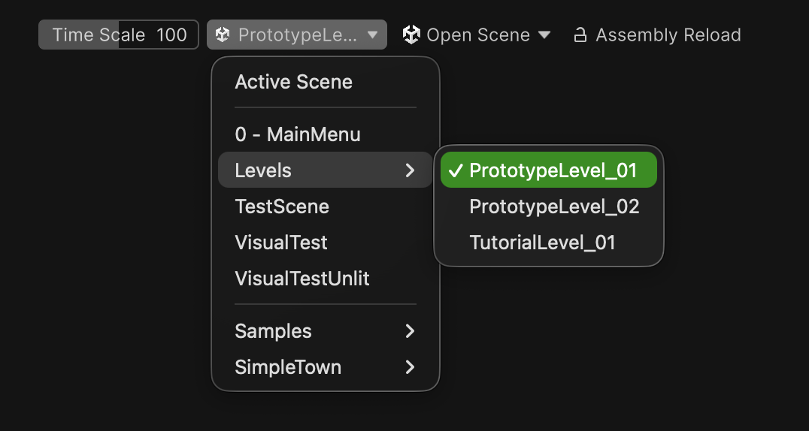

# Unity-Toolbar-Extras
Collection of custom Unity [Main Toolbar Elements](https://docs.unity3d.com/ScriptReference/Toolbars.MainToolbarElementAttribute.html).

## Assembly Reload Lock

A toggle that locks or unlocks assembly reload using the [EditorApplication.LockReloadAssemblies](https://docs.unity3d.com/ScriptReference/EditorApplication.LockReloadAssemblies.html) API.

## Play-Mode Start Scene

Play-Mode Start Scene dropdown allows you to select the scene that will be loaded when entering Play Mode. It's done using the [EditorSceneManager.playModeStartScene](https://docs.unity3d.com/ScriptReference/SceneManagement.EditorSceneManager-playModeStartScene.html) API.

## Open Scene Dropdown

Open Scene dropdown allows you to quickly open a scene from the project window.
It also allows for scene creation using the [scene template window](https://docs.unity3d.com/6000.3/Documentation/Manual/CreatingScenes.html#new-scene-dialog).

In both Open Scene and Play-Mode Start Scene dropdowns the scene list behaves in the following way:
- All Scenes from the projects are shown with their folder structure used as menu paths.
- Scenes from the Packages folder are omitted.
- Scenes and folders from the Assets/Scenes folder are shown at the top of the list and are separated by a divider.

## Time Scale Slider

Simple slider that controls the time scale of the game.
Credits to [cookie1170](https://github.com/cookie1170/cookie-utils/)
